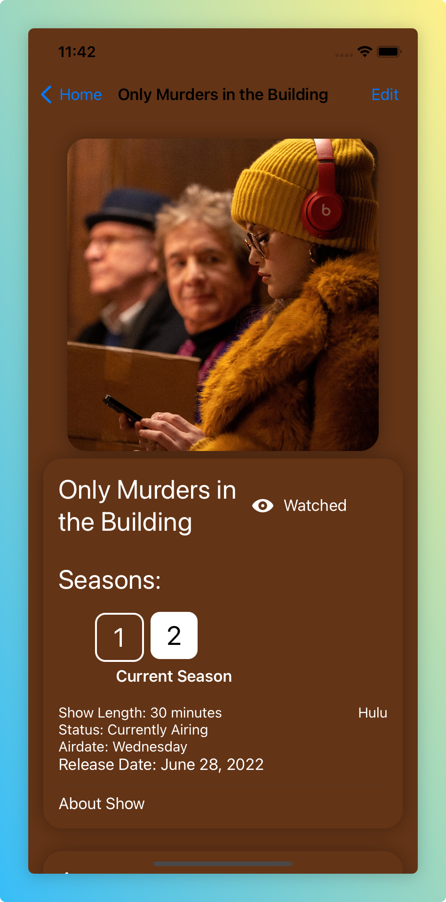
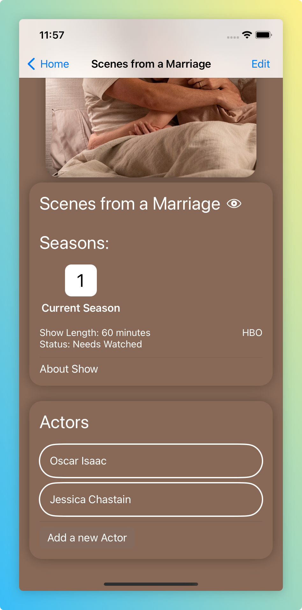

# TVShowApp

This is a side project of mine to experiment with iOS development. It is intended for personal use and replaces my old form of keeping track of TV shows I am watching. It allows for different filters, interesting visuals, and data manipulation. All the data is manually entered and can be manipulated by the app.

# Views

## Home

The home view is the view presented upon opening the app. It displays buttons to navigate to other pages while also showing rows of shows you might want to quickly access.

## Show Detail
   

The show detail view is a page that shows all the details of a particular show, including a section for its actors, with a dynamic background that matches the color of the show's image. It can be accessed by clicking on a show from the home page or by navigating to it from the watchlist. This page is also where you can edit the details of the show.

## Watchlist
 

The watchlist view is the best way to find a show. The page contains a list of shows with icons showing if the show has been watched and/or is still running and tags representing the platform it is on. The page also has filtering functionality for show length and service and includes a search bar to find the show you're looking for.

## Stats
 

The stats page shows some basic statistics about the show data. The page has a list of the actors who are included in the most shows I've added to the app dataset. It also uses Swift Charts to show a visual representation of how many shows are categorized by each status and how many shows have been added by streaming service.

# Skills used

## Data Fetching

All the data is held in JSON files in this repo which the app accesses using a REST API. Upon starting the app or when asked to reload, the app fetches the JSON files and parses them into Swift objects. When it comes time to save the data, it converts it to a JSON object and commits it to the repo. Because of this, the number of commits on the repo is inflated.

## Swift Language

The app is written entirely in Swift and SwiftUI as the purpose was for this to be a learning experience for me. The app deals with HTTP requests, parsing the data returned into Swift objects, and manipulating it throughout the app. It gives some great exposure to the languages varying data structures, like dates, class hierarchy, and enums. The app also explores some of the functionality unique to iOS such as notifications and Swift Charts.

# Future Development:

- Fix Navigation Bugs
- Update the stats page so graphs use colors of the streaming services
- Improve the object relationship between actors and shows as it presents many bugs
- Update the data source to a database or separate repo
- Loading show and/or actor data, such as photos from online (ex: IMDB)

# Acknowledgements
This follows many of the concepts taught in Apple's SwiftUI and IOS tutorials, however significantly expands on them with more views, more complex filters, etc. The process of obtaining dynamic backgrounds on show pages comes from here: https://medium.com/swlh/swiftui-read-the-average-color-of-an-image-c736adb43000, but is adapted to fit my project. I do not own any of the rights to the photos used.
